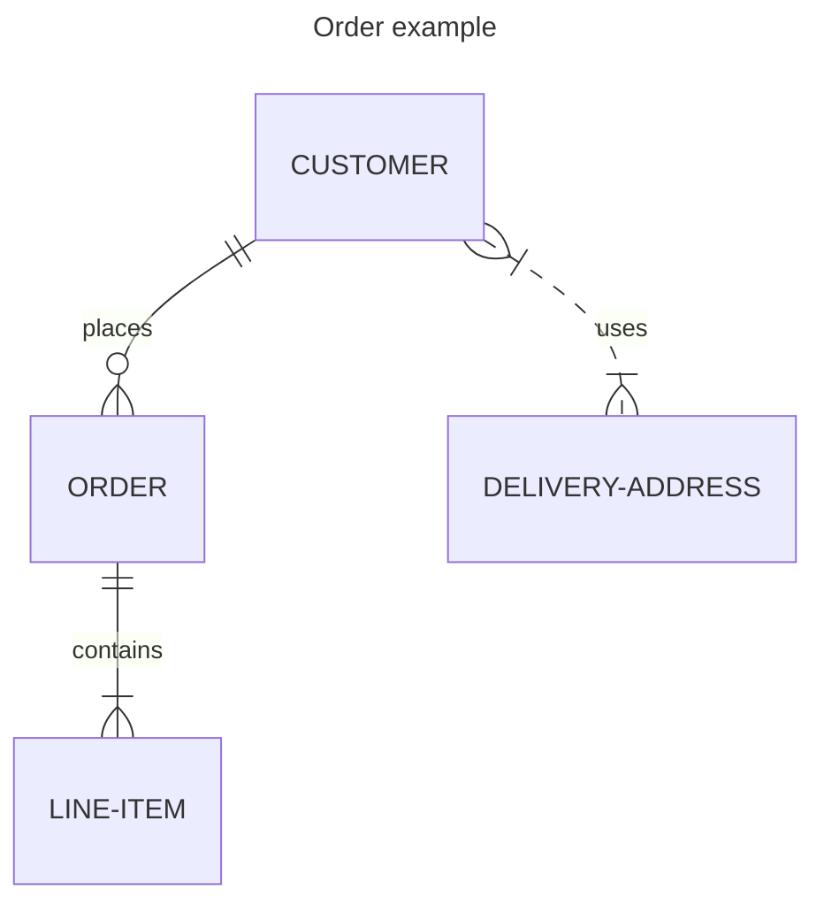

## 1.1 Latar Belakang

Project ini di latar belakangi oleh berbagai macam faktor yang antara lain ialah bahwa sekarang zaman semakin berkembang pesat, dan teknologi merupakan salah satu faktor yang menyebabkan zaman berkembang dengan sangat cepat, maka dari itu kita harus bisa menjadi bagian dari perkembangan zaman, hal itu bisa kita ambil dari langkah awal yaitu penguasaan teknologi zaman sekarang, yang dimana kita bisa berusaha untuk mengimbangi majunya teknologi dengan membuat sebuah aplikasi, salah satunya adalah aplikasi game yang penulis sedang rancang.

Melihat generasi muda zaman sekarang senang sekali bermain dan berkompetisi dalam sebuah game yang kemudian bisa menjadi inspirasi kita bersama agar bisa ikut andil dalam perkembangan teknologi dan zaman melalui cara mengembangkan sebuah game, baik itu ber-gendre RPG (Role Playing Game), FPS (First Person Shooting), TPS (Third Person Shooting), RTS (Real Time Strategy), dan lainnya.

Dari pemaparan di atas, penulis memutuskan untuk mengembangkan sebuah aplikasi game yang ber-genre "Action RPG", yang kurang lebihnya menyerupai game "Mario Bros"

## 1.2. Deksripsi Teknologi Informasi

Game Crazy Adventure merupakan game tentang sebuah karakter yang bernama toby yang dimana dia menyelesaikan misi dan menjelajahi dunia untuk membasmi monster di seluruh penjuru dunia dengan tujuan menciptakan kembali dunia yang aman untuk ditinggali. Game ini merupakan 2D pixel art games.

## 1.3. Branding

*Branding* meliputi:
1. Merk: Crazy Adventure.
2. Tagline: Petualangan yang akan membuatmu gila.
3. Campign: Membuat aplikasi yang dimana user mendapatkan pengalaman berpetualang yang seru dan menegangkan.
4. Target user:
- Usia 10+
- Seseorang yang senang berpetualang.
- Seseorang yang berani menyelesaikan tantangan.
- Seseorang pencinta pixel art game.
5. User Experience Theme:
- Menantang.
- Menyenangkan.
- Inspirasi design:
- 
- 

## 2. User Story

Sebagai | Saya ingin bisa | Sehingga | Prioritas
---|---|---|---
Pengguna | Menggerakkan karakter | Bisa menjalankan fitur utama game | ⭐⭐⭐⭐⭐
Pengguna | Mengakses *Inventory* | Bisa menyimpan item drop dari npc (monster) | ⭐⭐⭐⭐
Pengguna | Menggunakan *skill* | Bisa membunuh npc (monster | ⭐⭐⭐⭐⭐
Pengguna | Mengeksplor map | Bisa menamatkan setiap misi yang ada di manapun di map | ⭐⭐⭐⭐
Pengguna | Mengakses  *store* | Bisa membeli item untuk membantu player *level up* | ⭐⭐⭐⭐
Pengguna | Menyimpan progress game | Bisa melanjutkan game dari terakhir kali menyimpan progress game | ⭐⭐⭐⭐⭐

## 3. Struktur Data

## 4. Arsitektur Sistem
(--)

## 5. Teknologi, Library, dan Framework

Godot aplikasi pembuat game 2D dan 3D.

## 6. Desain User Experience dan User Interface

## 7. Demonstrasi Video

(--)

## 8. Bagaimana mesin komputasi dan sistem operasi berperan dalam produk teknologi informasimu ?

(--)

## 9. Bagaimana algoritma, struktur data, dan bahasa pemrograman berperan dalam produk teknologi informasimu ?

(--)

## 10. Bagaimana metode pengembangan perangkat lunak / Software Development Life Cycle berperan dalam produk teknologi informasimu ?

(--)

## 11. Bagaimana database / sistem basis data berperan dalam produk teknologi informasimu ?

(--)
